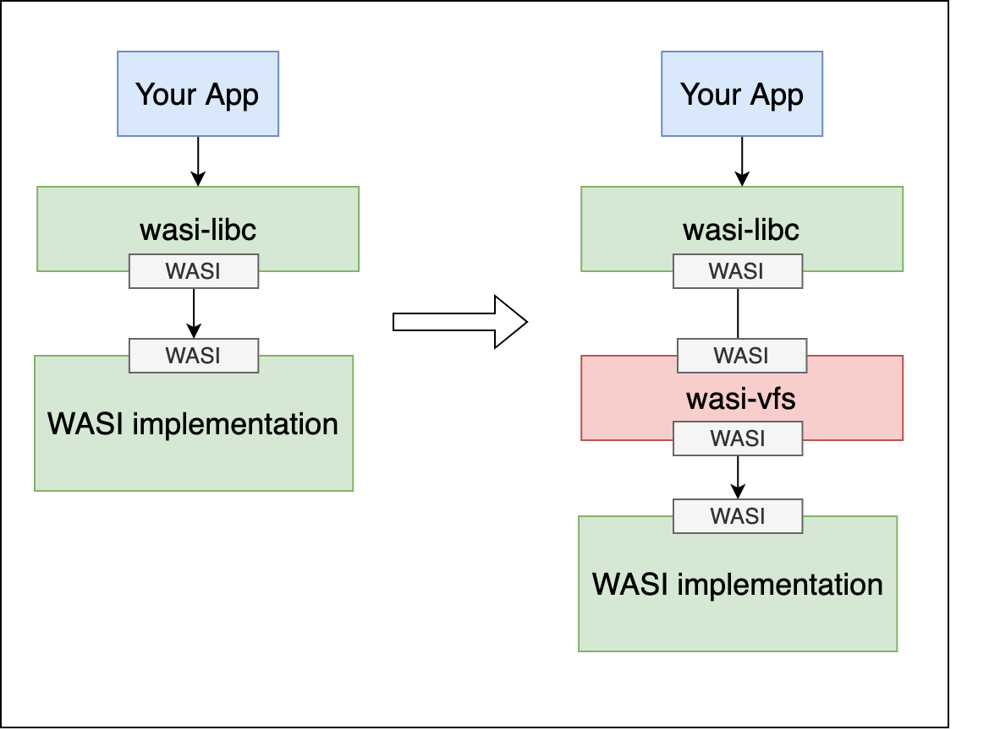

# wasi-vfs

[](https://crates.io/crates/wasi-vfs)

A virtual filesystem layer for WASI.

> **NOTICE**: This project currently supports only WASI applications on the top of [wasi-libc](https://github.com/webassembly/wasi-libc)

This project provides a language and host-agnostic virtual filesystem layer for WASI.

<div align="center">
  
</div>

## Supported filesystems

- **Embedded file system**: a read only file system embedded in the `.wasm` binary.
- to be implemented more...

## Installation

### Binary

A typical installation from the release binaries might look like the following:

```console
$ export WASI_VFS_VERSION=0.2.0

# For x86_64 Linux host machine
$ curl -LO "https://github.com/kateinoigakukun/wasi-vfs/releases/download/v${WASI_VFS_VERSION}/wasi-vfs-cli-x86_64-unknown-linux-gnu.zip"
$ unzip wasi-vfs-cli-x86_64-unknown-linux-gnu.zip

# For x86_64 macOS host machine
$ curl -LO "https://github.com/kateinoigakukun/wasi-vfs/releases/download/v${WASI_VFS_VERSION}/wasi-vfs-cli-x86_64-apple-darwin.zip"
$ unzip wasi-vfs-cli-x86_64-apple-darwin.zip

# For arm64 macOS host machine
$ curl -LO "https://github.com/kateinoigakukun/wasi-vfs/releases/download/v${WASI_VFS_VERSION}/wasi-vfs-cli-aarch64-apple-darwin.zip"
$ unzip wasi-vfs-cli-aarch64-apple-darwin.zip

# See release page for more platforms: https://github.com/kateinoigakukun/wasi-vfs/releases

$ mv wasi-vfs /usr/local/bin/wasi-vfs
```

### Homebrew

```console
$ brew tap kateinoigakukun/wasi-vfs https://github.com/kateinoigakukun/wasi-vfs.git
$ brew install kateinoigakukun/wasi-vfs/wasi-vfs
```

## Building

To build the project, you need to install the [`wasi-sdk`](https://github.com/WebAssembly/wasi-sdk) version 14.0 or later.

```console
$ git clone https://github.com/kateinoigakukun/wasi-vfs.git --recurse-submodules
$ cd wasi-vfs
$ export WASI_VERSION=14
$ export WASI_VERSION_FULL=${WASI_VERSION}.0

# For x86_64 Linux host machine
$ curl -LO https://github.com/WebAssembly/wasi-sdk/releases/download/wasi-sdk-${WASI_VERSION}/wasi-sdk-${WASI_VERSION_FULL}-linux.tar.gz
$ tar xvf wasi-sdk-${WASI_VERSION_FULL}-linux.tar.gz

# For x86_64 and arm64 macOS host machine (since wasi-sdk doesn't provide prebuilt binaries for M1, so use x64 binaries on Rosetta)
$ curl -LO https://github.com/WebAssembly/wasi-sdk/releases/download/wasi-sdk-${WASI_VERSION}/wasi-sdk-${WASI_VERSION_FULL}-macos.tar.gz
$ tar xvf wasi-sdk-${WASI_VERSION_FULL}-macos.tar.gz

$ export WASI_SDK_PATH=$PWD/wasi-sdk-${WASI_VERSION_FULL}
$ cargo build --target wasm32-unknown-unknown
```

## Demo

### Prerequisites

Set `$WASI_SDK_PATH` environment variable to the path of the `wasi-sdk` (version 14 or later).

### Build and run WASI application

```console
$ git clone https://github.com/kateinoigakukun/wasi-vfs.git --recurse-submodules
$ cd wasi-vfs

# Build libwasi_vfs.a
$ cargo build --target wasm32-unknown-unknown

# Build a WASI app with libwasi_vfs.a
$ $WASI_SDK_PATH/bin/clang -target wasm32-unknown-wasi -o getline.wasm examples/getline.c ./target/wasm32-unknown-unknown/debug/libwasi_vfs.a

# Run the WASI app with --mapdir
$ wasmtime run --mapdir /::./examples/mnt getline.wasm -- /hello.txt
Hello

# Pack ./examples/mnt directory into a WASM binary
$ cargo run -p wasi-vfs-cli -- pack getline.wasm --mapdir /::./examples/mnt -o getline.packed.wasm

# Run the WASM binary again without --mapdir
$ wasmtime run getline.packed.wasm -- /hello.txt
Hello
```

## Testing

### Unit tests

```console
$ CARGO_TARGET_WASM32_WASI_RUNNER=wasmtime cargo test --target wasm32-wasi
```

### End-to-end tests

```console
$ cargo build --target wasm32-unknown-unknown
$ LIB_WASI_VFS_A=$PWD/target/wasm32-unknown-unknown/debug/libwasi_vfs.a ./tools/run-make-test.sh
```


## How does it work?

`wasi-vfs pack` command is a wrapper of [`wizer`](https://github.com/bytecodealliance/wizer/), which is a pre-initializer for Wasm applications.
The initialization process scans the mapped directories, then copies them into in-memory virtual filesystem.

## Limitations

Currently, this project only supports WASI applications on the top of wasi-libc because of the following reasons:

This project depends on `wasm-ld` and `wasi-libc`'s imported symbol behavior.
  `wasi-libc` declares some external symbols to import WASI functions in C like below. When `__imported_wasi_snapshot_preview1_fd_read` is not defined in any input object files, `wasm-ld` produces a `(import "wasi_snapshot_preview1" "fd_read")` entry. This is how `wasi-libc` calls WASI functions.

```c
int32_t __imported_wasi_snapshot_preview1_fd_read(int32_t arg0, int32_t arg1, int32_t arg2, int32_t arg3) __attribute__((
    __import_module__("wasi_snapshot_preview1"),
    __import_name__("fd_read")
));
```

This project exploits that external symbols to hook WASI function calls by defining them in `libwasi_vfs.a`. If those symbols are defined, `wasm-ld` doesn't produce import entries, and it links symbols normally.

Therefore, this project currently doesn't support Rust application, which calls WASI functions directly without using `wasi-libc`.


After [module-linking](https://github.com/WebAssembly/module-linking/blob/main/design/proposals/module-linking/Explainer.md) and [interface-types](https://github.com/WebAssembly/interface-types) will be merged, and WASI will adopt shared-nothing architecture, this project will be able to support all WASI applications.
